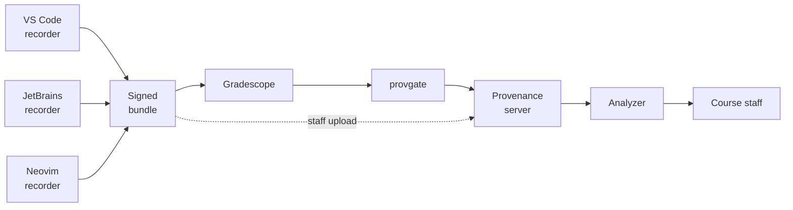

<picture>
  <source media="(prefers-color-scheme: dark)" srcset="https://raw.githubusercontent.com/ProvenanceTools/provenance/main/brand/exports/lockup-dark.png" />
  
</picture>

**An academic-integrity telemetry and analysis system.**

Provenance records how a student's code came into existence.

Finished code carries no record of where it came from. A function typed over ten minutes, pasted out of a chat window, or written by an agent in another terminal all reach the grader byte-identical. Provenance records the difference while it happens.

The recorder runs in the student's editor and writes a hash-chained log of the session. At submission the log seals into a bundle signed with a per-session key, which the student uploads alongside their code. Staff ingest a cohort at a time and get a timeline, a replay, eight validation checks, and 24 tunable heuristics.

It is not a plagiarism detector. Nothing in it grades the code — the heuristics run over events, and once a bundle is ingested the server drops the student's source files and stores only the log.

## How the pieces fit

## What it records

The log has 21 event types. These are all of them:

- **Session start, end, and heartbeats** — the assignment, a machine id, editor and recorder versions, whether the window is focused, and how long it's been idle.
- **Files opened, saved, and closed** — path, content hash, and the file's contents at the moment it's opened.
- **Every edit, as a diff** — the text that changed, where it landed, and whether it looked typed or pasted.
- **Pastes** — where, how much, and the pasted text itself.
- **Selection and caret movement.**
- **Editor focus**, gained and lost.
- **Terminal commands** and their exit codes.
- **Git operations** and commit hashes.
- **Files changed outside the editor** — hashes before and after, and the new contents.
- **Installed extensions** and their versions, once per session.
- **The recorder's own faults** — clock jumps, a broken chain, degraded mode, recovery from a corrupted log.

All of it is scoped to the assignment folder.

## Repositories

| Repo | What it is |
| --- | --- |
| [**provenance**](https://github.com/ProvenanceTools/provenance) | The monorepo: the log format (`log-core`), the VS Code recorder, the analysis engine (`analysis-core`), the React analyzer, and the Hono + Postgres API server. |
| [**provenance-jetbrains-recorder**](https://github.com/ProvenanceTools/provenance-jetbrains-recorder) | `provjet` — the recorder ported to JetBrains IDEs in Kotlin, producing bundles in the same format as the VS Code one. |
| [**provenance-neovim-recorder**](https://github.com/ProvenanceTools/provenance-neovim-recorder) | `provnvim` — the recorder ported to Neovim in pure Lua, producing bundles in the same format as the VS Code one. |
| [**provenance-gradescope-gateway**](https://github.com/ProvenanceTools/provenance-gradescope-gateway) | `provgate` — pulls new Gradescope submissions and forwards them to a Provenance server on a schedule. A pure HTTP client of the public API. |

## Scope

The recorder makes no network calls during a session. The log stays on the student's machine until they upload it themselves.

It starts only in a workspace holding a course-signed manifest, and records only what that manifest covers. There are no OS-level hooks — it reads the editor's own document events, so it sees diffs, not keystrokes.

The protocol is public, the source is readable, and students are expected to read it. Nothing here depends on them not knowing how it works.

---

Apache-2.0. Provenance is an independent project, not affiliated with, endorsed by, or sponsored by Microsoft, Google, or Turnitin.
